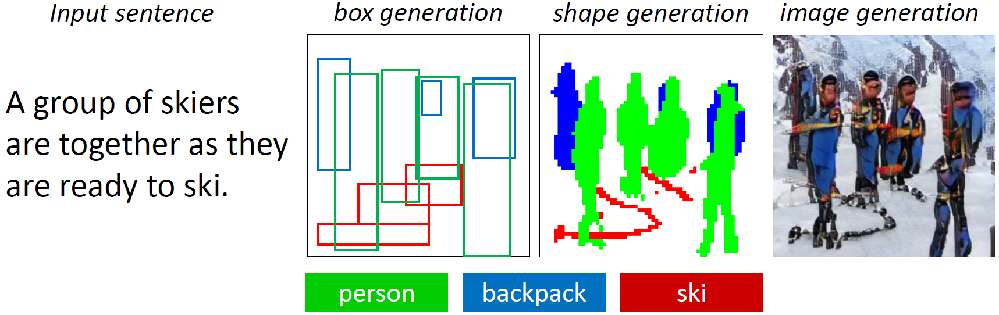
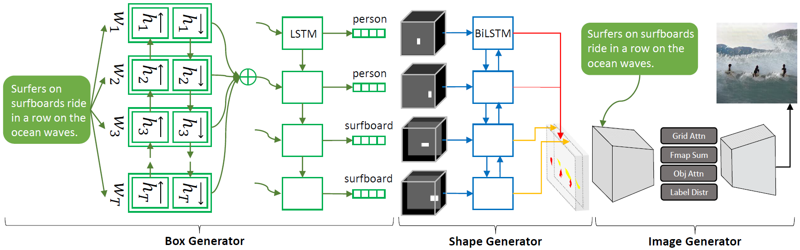

# Obj-GAN
## Obj-GAN - Official PyTorch Implementation

Pytorch implementation for reproducing Obj-GAN results in the paper [Object-driven Text-to-Image Synthesis via Adversarial Training](https://arxiv.org/pdf/1902.10740.pdf) by [Wenbo Li*](https://www.albany.edu/~wl523363/main.html), [Pengchuan Zhang*](https://www.microsoft.com/en-us/research/people/penzhan/), [Lei Zhang](https://www.microsoft.com/en-us/research/people/leizhang/), [Qiuyuan Huang](https://www.microsoft.com/en-us/research/people/qihua/), [Xiaodong He](https://air.jd.com/people-detail.html?id=2), [Siwei Lyu](http://www.cs.albany.edu/~lsw/index.html), [Jianfeng Gao](https://www.microsoft.com/en-us/research/people/jfgao/). (This work was performed when Wenbo was an intern with Microsoft Research).



**Picture:** *If you are asked to draw a picture of several people in their ski gear are in the snow, chances are you will start with an outline of four persons with positioned reasonably in the center of the canvas, then add a sketch of the skis under their feet. Although it is not mentioned in the description, you may decide to add one backpack to each of them to match our common sense. Finally, you carefully finish the details, like painting their clothes blue, their scarves pink and the background white, to make the persons more realistic and the background matches the description better. To make the scene more vivid, you might sketch some brown stones in the snow which indicates that they are in mountains.*

*Now, there’s a bot that can do that, too.*



### Dependencies
python 3.6

Pytorch 0.4.1

In addition, please add the project folder to PYTHONPATH and `pip install` the following packages:
- `python-dateutil`
- `easydict`
- `pandas`
- `torchfile`
- `nltk`
- `scikit-image`
- `spacy`
- `PyYAML`
- `cffi`
- `torchtext`
- `dill`
- `Cython`

**Data**

1. Download our preprocessed metadata for [coco](https://drive.google.com/open?id=1GbZESaDwkpV8gH2gyo1bUogPtYu1QEPF) and merge them to `data/coco`
2. Download [coco](http://cocodataset.org/#download) dataset, extract the images to `data/coco/images`, and extract the annotations to `data/coco/insanns`

**Training**

- Train box generator:
  - `cd box_generation`
  - `python sample.py --is_training 1`
- Train shape generator:
  - `cd shape_generation`
  - `./make.sh`
  - `python main.py --gpu '0,1' --FLAG`
- Train image generator:
  - `cd image_generation`
  - `./make.sh`
  - `python main.py --gpu '0,1' --FLAG`

**Pretrained Model**

Download and save them to `data/coco/pretrained/`
- [DAMSM for coco](https://drive.google.com/open?id=1zIrXCE9F6yfbEJIbNP5-YrEe2pZcPSGJ)
- [Inception v3](https://download.pytorch.org/models/inception_v3_google-1a9a5a14.pth)
- [VGG19 BN](https://download.pytorch.org/models/vgg19_bn-c79401a0.pth)
- [Box generator](https://drive.google.com/file/d/1OTZDywt1UGzUykAXBXmvVA6aAlQzbMjv/view?usp=sharing)
- [Shape generator](https://drive.google.com/file/d/1vyfXxh4eC1ccs9XNhC8OIylErhwLdvmN/view?usp=sharing)
- [Image generator](https://drive.google.com/file/d/1BWXJT5Wg0x0Ajatgb2VdSQG14ndG8CGM/view?usp=sharing)

Note that we have made some modifications (changing the obj attention estimation from "dot product between Glove embeddings" to "cosine similarity between Glove embeddings") based on the code for CVPR submission, and trained 120 epochs using batch size 16. Compared to the results in the paper, the updated results are better on FID and R-prsn scores, and worse on Inception score (because we do not get a chance to train the model using larger batch size).

| Methods  | Inception :arrow_up: | FID :arrow_down: | R-prsn :arrow_up: |
| ------------- | ------------- | ------------- | ------------- |
| Obj-GAN (pred box & pred shp)  | 27.32 ± 0.40 | 24.70 | 91.91 ± 2.37 |
| Obj-GAN (gt box & pred shp)  | 28.22 ± 0.35 | 22.67 | 93.00 ± 2.15 |
| Obj-GAN (gt box & gt shp)  | 31.01 ± 0.27 | 17.03 | 94.42 ± 2.03 |

Tips for optimizing the Inception score (though it is boring):
- Increase the batch size as large as possible via distributed training
- Increase the weight for the DAMSM loss

**Sampling**

- Run box generator:
  - `cd box_generation`
  - `python sample.py --is_training 0 --load_checkpoint [replace with your ckpt path]`
- Run shape generator:
  - `cd shape_generation`
  - `python main.py --gpu '0,1' --NET_G [replace with your ckpt path]`
- Run image generator:
  - `cd image_generation`
  - `python main.py --gpu '0,1' --NET_G [replace with your ckpt path]`

**More Results**


### Citing Obj-GAN
If you find Obj-GAN useful in your research, please consider citing:

```
@article{objgan19,
  author    = {Wenbo Li, Pengchuan Zhang, Lei Zhang, Qiuyuan Huang, Xiaodong He, Siwei Lyu, Jianfeng Gao},
  title     = {Object-driven Text-to-Image Synthesis via Adversarial Training},
  Year = {2019},
  booktitle = {{CVPR}}
}
